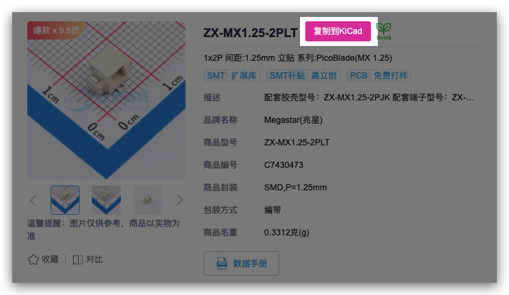
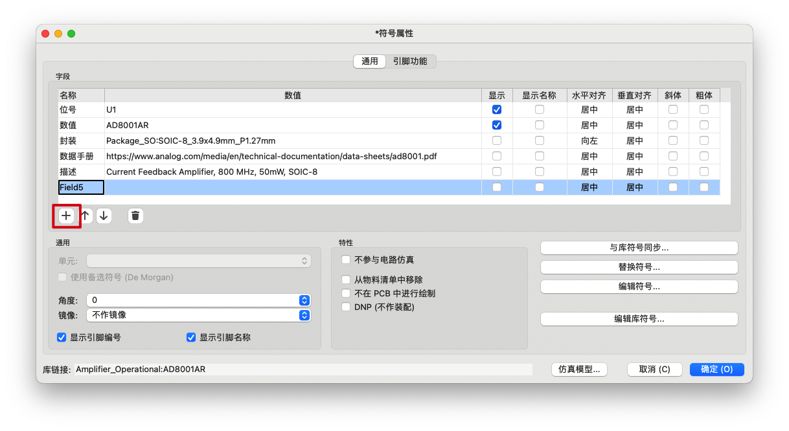
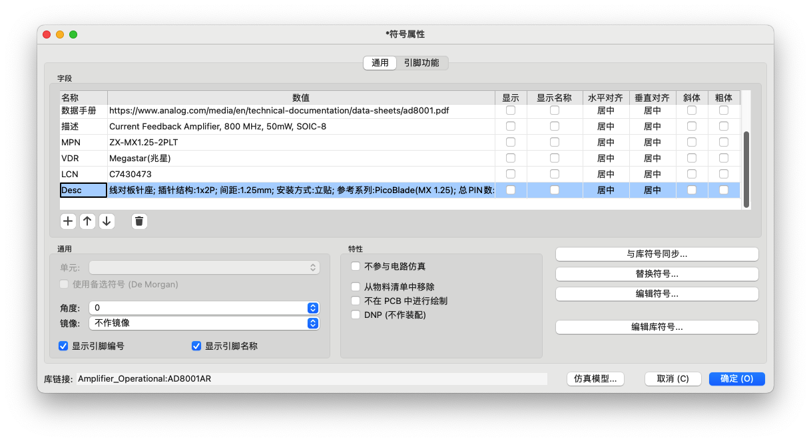

# LCSC-KiCad-Helper  
[](LICENSE)
专为嵌入式工程师、电子系统开发者打造, 一键提取商品关键信息（品牌/型号/编号/参数），自动格式化为 KiCad 符号属性字段，告别手动录入，提升硬件设计效率！

---

## ✨ 特性

| 功能 | 说明 |
|------|------|
| 🔍 **精准提取** | 从立创商城商品页（`https://item.szlcsc.com/xxx`）抓取：<br>• 品牌名称（`VDR`）<br>• 商品型号（`MPN`）<br>• 商品编号（`LCN`）<br>• 全量参数表（`Desc` 字段） |
| 🧽 **智能清洗** | 自动去除零宽空格、合并换行、过滤“—”“无”等无效值，参数紧凑可读 |
| 📋 **KiCad 友好格式** | 输出为标准制表符分隔字段，含对齐/位置占位符，**可直接粘贴进 KiCad Symbol Properties** |

---

## 📸 效果演示

### 1. 立创商品页注入按钮  
在商品标题右侧注入「复制到KiCad」按钮


### 2. 复制内容示例（可直接粘贴至 KiCad Symbol Fields）  
```text
MPN	ZX-MX1.25-2PLT	0	0	居中	居中	0	0
VDR	Megastar(兆星)	0	0	居中	居中	0	0
LCN	C7430473	0	0	居中	居中	0	0
Desc	线对板针座; 插针结构:1x2P; 间距:1.25mm; 安装方式:立贴; 参考系列:PicoBlade(MX 1.25); 总PIN数:2P; 排数:1; 每排PIN数:2; 额定电流:1A; 触头材质:黄铜; 触头镀层:锡; 工作温度:-25℃~+85℃; 额定电压:125V; 附加特征:辅助焊脚; 颜色:米色; Z轴-板上高度:4.7mm; X轴-板上底边长度(间距线):7.5mm; Y轴-板上底边宽度:4.4mm	0	0	居中	居中	0	0
```

### 3. 粘贴到KiCad Symbol Fields  
3.1 点击加号添加字段, 然后按`ESC`键, 取消编辑

3.2 按`Ctrl+v`键粘贴, 自动填入MPN VDR LCN Desc字段


### 完成 🎉🎉🎉